# Deep Reinforcement Learning Algorithm Research for Multi-Robot Cooperative Observation Scenarios
[](https://doi.org/10.5281/zenodo.15659231)


## 📘 Overview

This project aims to address multi-robot cooperative observation tasks (also known as **CMOMMT**, short for *Cooperative Multi-Robot Observation of Multiple Moving Targets*) using **deep reinforcement learning (DRL)** algorithms.

The main contributions of this project are:

1. ✅ **Framework Design**: Designed and implemented an efficient **multi-agent DRL training framework** for cooperative observation scenarios.

2. 🧠 **Probabilistic Estimation**: Proposed a **probabilistic matrix estimation method** to enhance the expressiveness of the observation space in partially observable environments.

3. 🌍 **Environment & Benchmark**: Open-sourced a realistic **multi-robot cooperative observation environment** and constructed a **benchmark suite** for algorithm evaluation.

4. 🧪 **Algorithm Implementation**: Implemented several **mainstream multi-agent reinforcement learning algorithms** and validated their performance on the benchmark.

5. 🧭 **Hierarchical Policy**: Introduced a **hierarchical policy architecture** to decouple cooperative exploration and tracking, effectively addressing their trade-off.

This project is part of my **master’s thesis research** and is intended to support further studies in multi-agent coordination and perception.

If you find this project helpful, please consider giving it a ⭐ on GitHub!

#### 🧩 Basic Assumptions

* each robot can observe targets in a field of view (within its search radius)
* each robot can communicate with each within its communicate radius
* each robot can get its location with respect to global frame 
* Each target can perceive observers within its sensing radius and moves according to a certain strategy (e.g., evasion)
* Both robots and targets are subject to nonholonomic motion constraints
* The combined search area of all robots is much smaller than the total area of the environment.

#### 🎯 Objective

the global objective is to **maximize the collective time during which targets are observed**, which means the problem is to maximize not only the number of targets under observation but also the duration of observation for each target.


#### ✨ Features

- [x] Support for dynamically changing number of agents and map size
- [x] Support parallel training and evaluating

#### 🤖 Implemented Algorithms

- IQL
- QMIX
- MAPPO
- IPPO
- Distributed MARL  
- A-CMOMMT *(traditional algorithm)*
- Hierarchical MARL

#### 🚀 Quick Start

**Install required packages:**

```
pip install -r requirements.txt
cd Package/SAT_ENV
pip install -e .
cd Package/Distributed_MARL
pip install -e .
```

**Training:**
```
python start_train.py --algo iql --learning_stage 3
```
**Evaluation in training Env**
```
python start_eval.py --algo iql --learning_stage 3
```
**Evaluation in Geneal Env**
```
python start_eval.py --full_test --algo iql --learning_stage 3
```
**All training and evaluation results will ba saved into data/ directory**

#### 📁 Code Structure

```
├── Package
│   ├── Distributed_MARL
│   │   └── distributed_marl    # distributed training MARL algorithm
│   │       ├── algos
│   │       │   ├── policy             #  core algorithm code
│   │       │   └── utils
│   │       ├── common            #  base distributed training architecture
│   │       ├── dqn_apex          # distributed DQN training architecture
│   │       ├── ppo                    # distributed PPO training architecture
│   │       │   └── common
│   │       └── utils
│   └── SAT_ENV               
│       └── satenv                # Base Env
│           ├── configs           # env config file
│           ├── dynamics      # env dynamic file
│           ├── env_utils
│           ├── policies          # internal agent policy

│           ├── agent.py       # env agent  object

│           └──base.py          # core env code       
├── algos                       # algorithm related code
│   ├── agents                  # agent object
│   ├── buffer		  # buffer object
│   ├── policy                  # core policy code
│   │   └── utils
│   ├── runner              # training and  evaluation architecture 
│   │   ├── dqn
│   │   └── ppo
│   └── utils
├── configs		# algorithm config file
│   ├── default
│   └── meta_policy
├── env_wrapper		
│   ├── draw           # Environmental Visualization
│   │   ├── animations
│   │   └── log
│   ├── env_utils
│   └── vecenv

│   ├── meta_env.py 	# env used for HRL training

│   └── popenv.py	    # env used for RL training

├── eval			# evaluation code 
├── network
│   ├── ac			# actor-critic net
│   ├── backbone	 # basic net
│   └── value        	# value net
├── train			# training function
└── utils
    └── scripts
```

## 🧠 Method

#### Environmental probabilistic matrix

 The environment is divided into a grid of size $L_x \times L_y$, and each grid cell is assigned a probability value indicating the likelihood of a target being present.

Each probability value is denoted as $P_{ij} \in [0,1]$, where:

- $P_{ij} = 0$ means it is confirmed that no target exists in the grid cell.
- $P_{ij} = 1$ means a target is definitely present in the grid cell.
- $P_{ij} = 0.5$ indicates complete uncertainty about the presence of a target in that region.

Since the robots have no prior knowledge of the environment at the beginning, all probability values are initialized to $0.5$.

The update steps of environmental probabilistic matrix is illustrated below. The color depth of each grid cell corresponds to the probability of a target being present within that cell—the deeper the color, the higher the probability. **This matrix encodes both the robot swarm’s understanding of the environment and the estimated likelihood of target locations at a given time.**

<p align="center">
    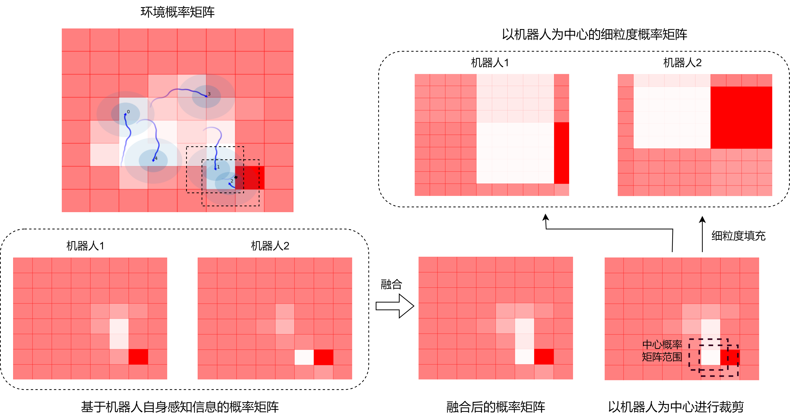
</p>

#### Feature Extraction Network

The observation space of each robot consists of two components: vector-based perceptual information and graph-based perceptual information. The vector-based information can be further divided into three parts depending on the agent's perspective:  
(1) the robot's own state information,  
(2) information about its teammate set, and  
(3) information about the target set.

<p align="center">
    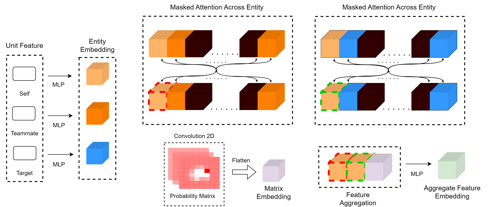
</p>

#### System Architecture

In the reinforcement learning framework, agents interact with the environment to learn an optimal policy by selecting actions according to 
`a_t ~ π*(a_t | τ^a)`, where the goal is to maximize the expected long-term discounted return 
`R = ∑_{i=0}^∞ γ^i r_{t+i+1}`, and `r_{t+i+1}` is the reward at time step `t+i+1`, with `γ` being the discount factor.


As shown below, the system first uses sensor information to update each robot’s local probability matrix. Then, probability matrices are fused with those from nearby robots within the communication range. The fused probability matrix and sensor data are jointly fed into the policy network to produce actions.

<p align="center">
    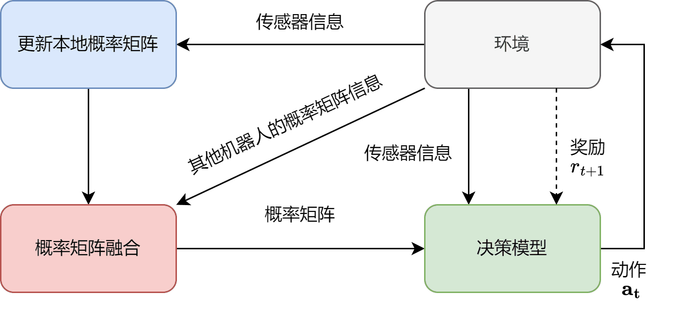
</p>

#### Reward

At time step $t$, the reward $r(i, t)$ received by robot $U_i$ from the environment consists of three components:  
the team exploration reward, the team tracking reward, and the collision avoidance penalty. 
**The exploration reward is based on environmental probabilistic matrix.**
Without the exploration reward, training performance drops significantly(as shown in the Benchmark section). 


## 📊 Benchmark

#### 🔧 Training Results Across Basic Algorithms 

<p align="center">
  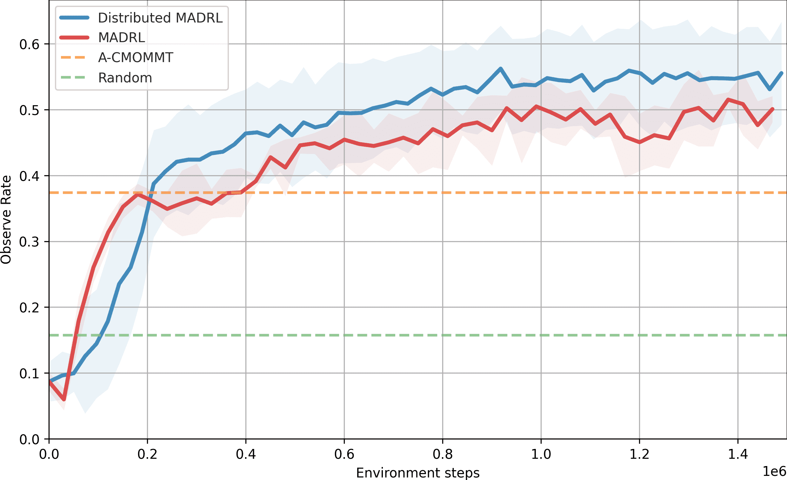
  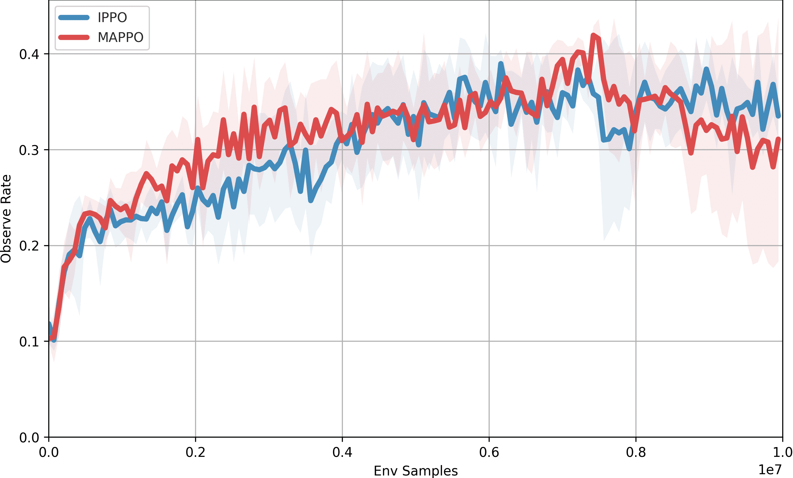
</p>

<p align="center">
  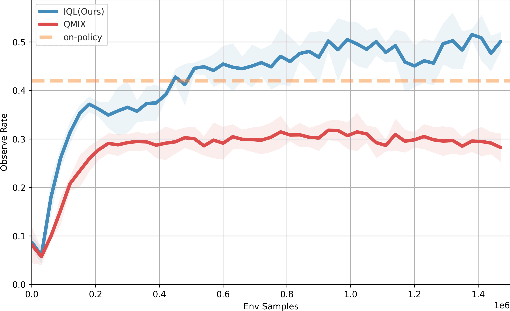
  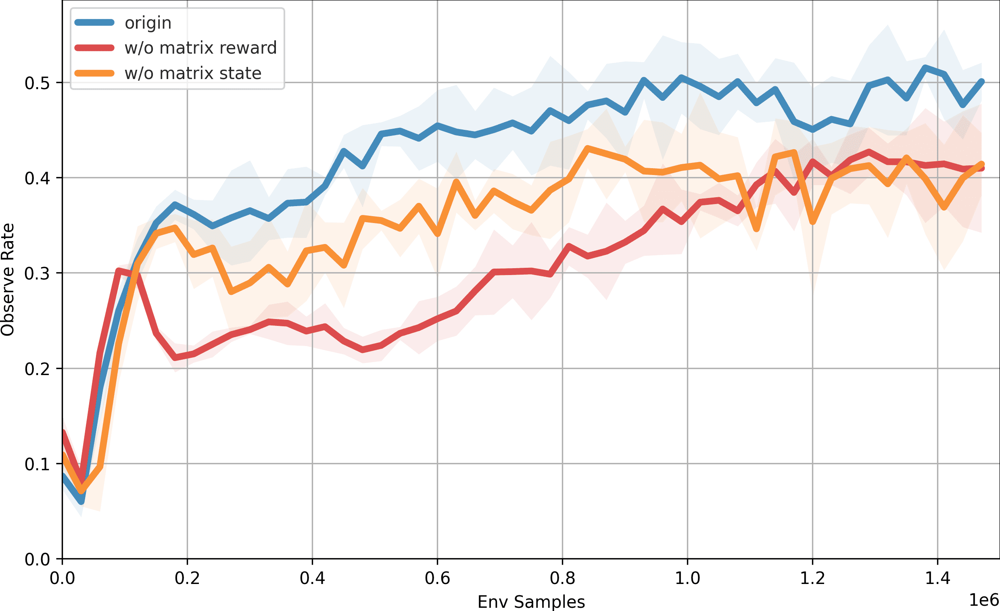
</p>

> All experiments are conducted in a 20×20 grid environment with **8 observers** and **8 moving targets**.

> All curves represent the **mean of 5 independent runs**, with shaded areas indicating standard deviation.

#### 🧪 Evaluation Results Across Basic Algorithms
<p align="center">
    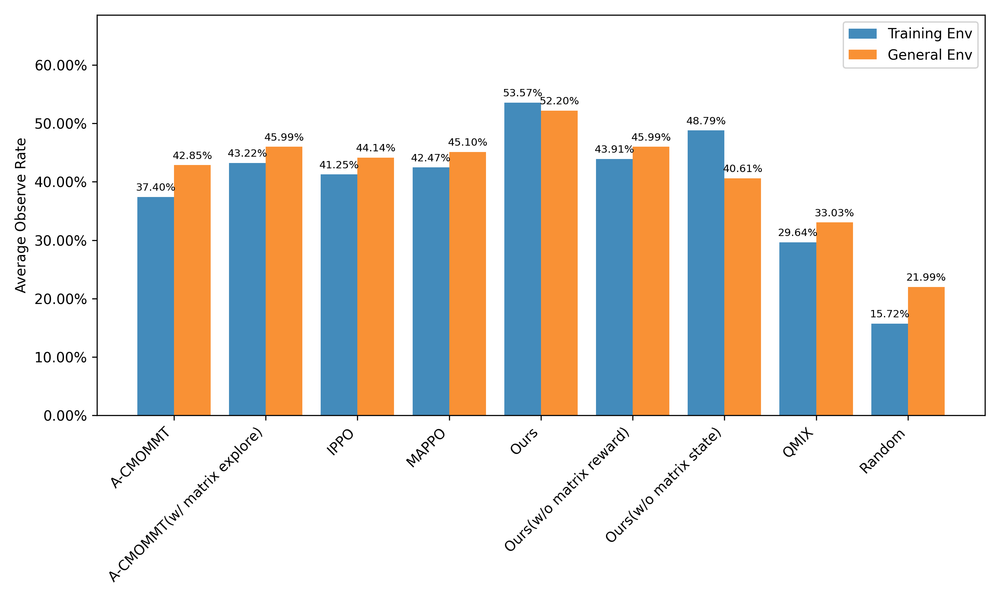
</p>

## 🧭 Hierarchical Policy

The cooperative observation behavior can be viewed as a time-wise combination of two sub-behaviors: cooperative exploration and cooperative tracking. At each time step, robots choose between these two behaviors to help maximize the number of observed targets.

In the early stage of the task, robots are encouraged to explore the environment to reduce uncertainty and discover potential targets. Once a target is found by multiple robots, nearby robots may choose to track it, while others may give up tracking and instead explore other areas or pursue different targets within their field of view.

The goal is for the robot team to learn an adaptive allocation between exploration and tracking through interaction with the environment, effectively balancing their trade-off and maximizing overall observation frequency. Notably, this coordination does not rely on explicit negotiation but emerges through local observations and a unidirectional communication mechanism.

<p align="center">
    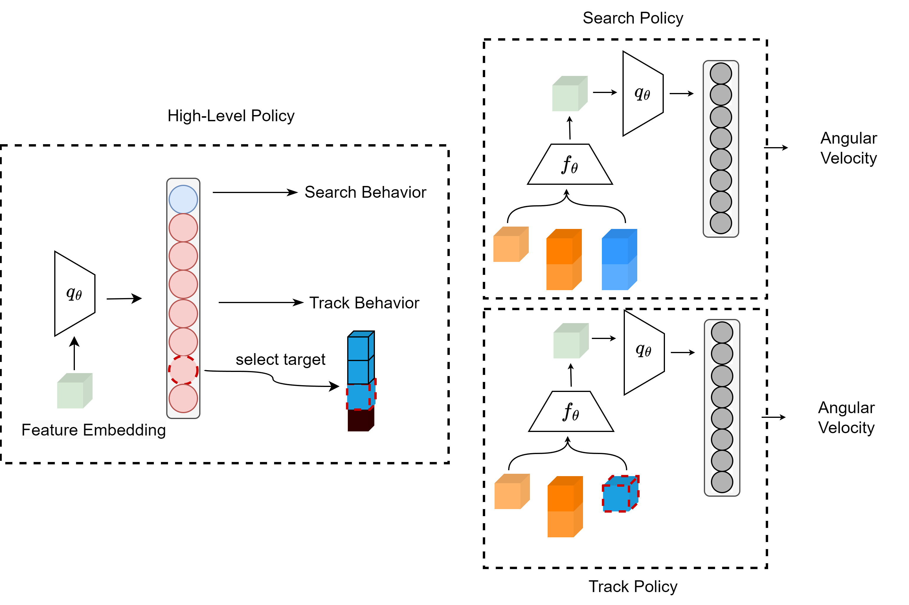
</p>

#### Hierarchical Policy Training Steps

**step1: train exploring policy**
```
python start_train.py --algo iql --learning_stage 0
```
**step2: train tracking policy**
```
python start_train.py --algo iql --learning_stage 1
```
**step3: train meta policy**
```
python start_train.py --algo iql --learning_stage 2
```

#### Hierarchical Policy Training Results

<p align="center">
  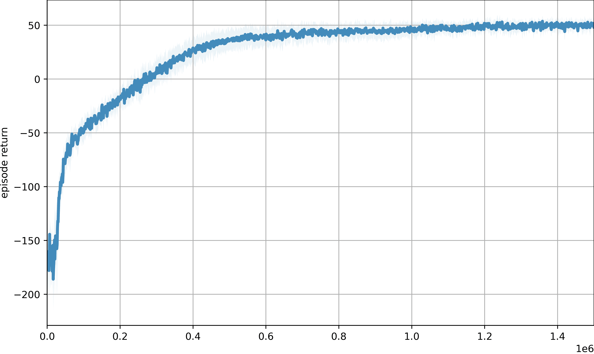
  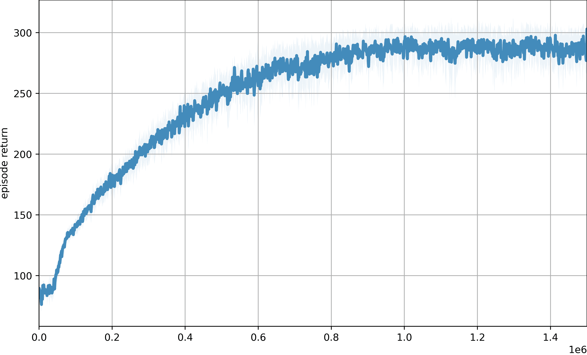
</p>

<p align="center">
  <strong>Left:</strong> Exploration Policy Results  
  <strong>Right:</strong> Tracking Policy Results
</p>

<p align="center">
  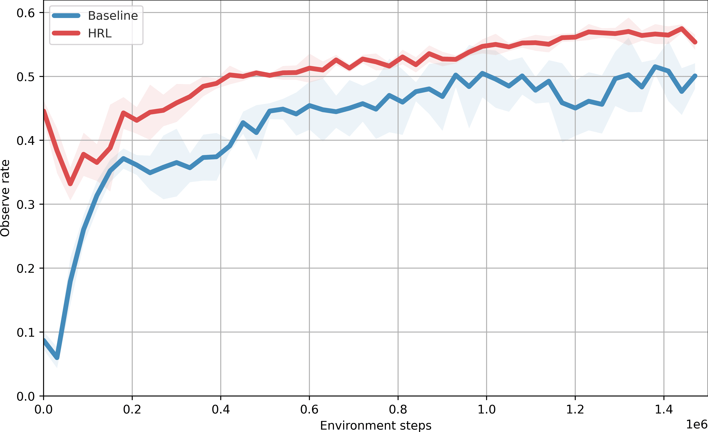
</p>

#### Hierarchical Policy evaluation Results

<p align="center">
  
  
</p>
<p align="center">
  <strong>Left:</strong> Geneal Env Results  
  <strong>Right:</strong>  Training Env Results
</p>

## 📚 Citation

If you find this project helpful in your research, please consider citing it

```
@software{Ruan_Deep_Reinforcement_Learning_2025,
author = {Ruan, Yudi},
doi = {10.5281/zenodo.15659232},
month = jun,
title = {{Deep Reinforcement Learning Algorithm Research for Multi-Robot Cooperative Observation Scenarios}},
url = {https://github.com/blakcapple/madrl-cmommt},
version = {1.0.0},
year = {2025}
}